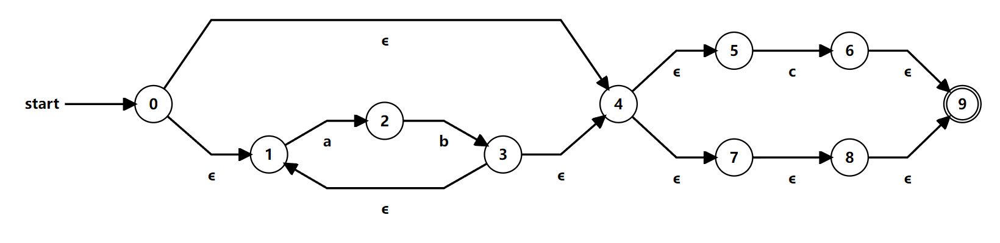

# Discussion 3 - Friday, September 15<sup>th</sup>

## Reminders

1. Project 2 due **Tuesday, September 19th** at **11:59 PM**
1. Quiz 1 today (first 20 minutes)

## Topic List

- Regex Patterns & Matching
- Finite State Machines
  - Deterministic Finite Automata (DFA)
  - Non-deterministic Finite Automata (NFA)

## Notes

### Key differences between NFA and DFA

- All DFAs are NFAs, but not all NFAs are DFAs.
- NFA can have ε-transition(s) between states.
- NFA states can have multiple transitions going out of them using the same symbol.
- DFAs are computationally cheaper to process, but often harder to read compared to NFAs.

## Execises

1. Consider the following NFAs:

    
    
    

    - What are some strings that would be accepted by each NFA?
    - What is an equivalent regex for each NFA?

2. Create an NFA for the following regex patterns:

    ```js
    2a. (ab)+c?
    2b. a|(bc)|b+
    2c. (bc|d)*a?
    ```
