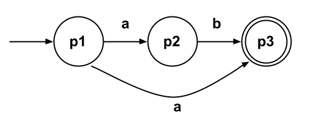

# Discussion 4 - Friday, September 22nd

## Reminders

1. Quiz 1 grades and solutions released, regrade requests open until **September 23rd @ 11:59pm**
1. Exam 1 is on **Thursday, October 5th**
1. Project 3 released, due **Friday, October 6th @ 11:59 PM**
1. Additional (+4) late tokens, see [@575](https://piazza.com/class/lkimk0rc39wfi/post/575)

## Topics List

- NFA to DFA conversion

## Notes

### ε-closure

`ε-closure(δ, p)` returns the set of states reachable from p using ε-transitions alone.

- ε-closure(p1) = { p1, p2, p3 }
- ε-closure(p2) = { p2, p3 }
- ε-closure(p3) = { p3 }
- ε-closure( { p1, p2 } ) = { p1, p2, p3 } ∪ { p2, p3 }

### move

`move(δ,p,σ)` returns the set of states reachable from p using exactly one transition on symbol σ.

- move(p1, a) = { p2, p3 }
- move(p1, b) = ∅
- move(p2, a) = ∅
- move(p2, b) = { p3 }
- move(p3, a) = ∅
- move(p3, b) = ∅
- move( {p1, p2} , b) = { p3 }

### Algorithm

Let $r_0$ = $\varepsilon\text{-closure}(\delta, q_0)$, add it to $R$\
While $\exists$ an unmarked state $r \in R$:\
&nbsp;&nbsp;&nbsp;&nbsp;&nbsp;&nbsp;Mark $r$\
&nbsp;&nbsp;&nbsp;&nbsp;&nbsp;&nbsp;For each $\sigma \in \Sigma$\
&nbsp;&nbsp;&nbsp;&nbsp;&nbsp;&nbsp;&nbsp;&nbsp;&nbsp;&nbsp;&nbsp;&nbsp;Let $E = \text{move}(\delta, r, \sigma)$\
&nbsp;&nbsp;&nbsp;&nbsp;&nbsp;&nbsp;&nbsp;&nbsp;&nbsp;&nbsp;&nbsp;&nbsp;Let $e = \varepsilon\text{-closure}(\delta, E)$\
&nbsp;&nbsp;&nbsp;&nbsp;&nbsp;&nbsp;&nbsp;&nbsp;&nbsp;&nbsp;&nbsp;&nbsp;If $e \notin R$\
&nbsp;&nbsp;&nbsp;&nbsp;&nbsp;&nbsp;&nbsp;&nbsp;&nbsp;&nbsp;&nbsp;&nbsp;&nbsp;&nbsp;&nbsp;&nbsp;&nbsp;&nbsp;Let $R = R \cup \\{e\\}$\
&nbsp;&nbsp;&nbsp;&nbsp;&nbsp;&nbsp;&nbsp;&nbsp;&nbsp;&nbsp;&nbsp;&nbsp;Let $\delta' = \delta' \cup \\{ r, \sigma, e \\} $\
Let $F = \\{r \mid \exists s \in r \text{ with } s \in F_n \\}$

## Exercises

1. Convert the following NFAs into DFAs:

   
   
   
   
